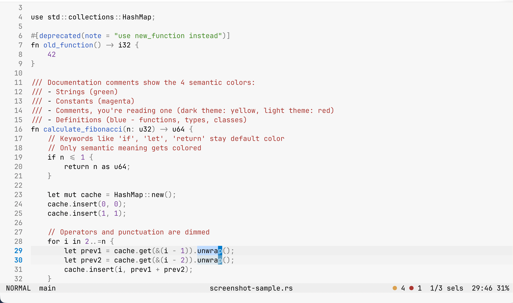
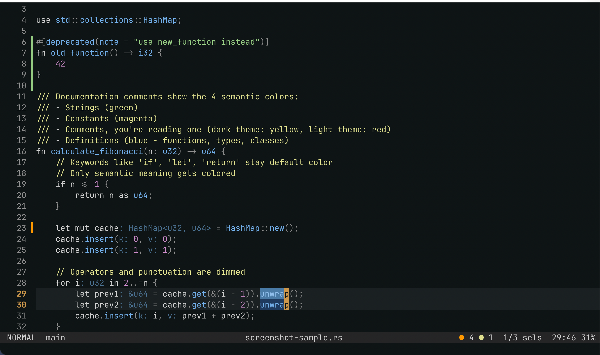
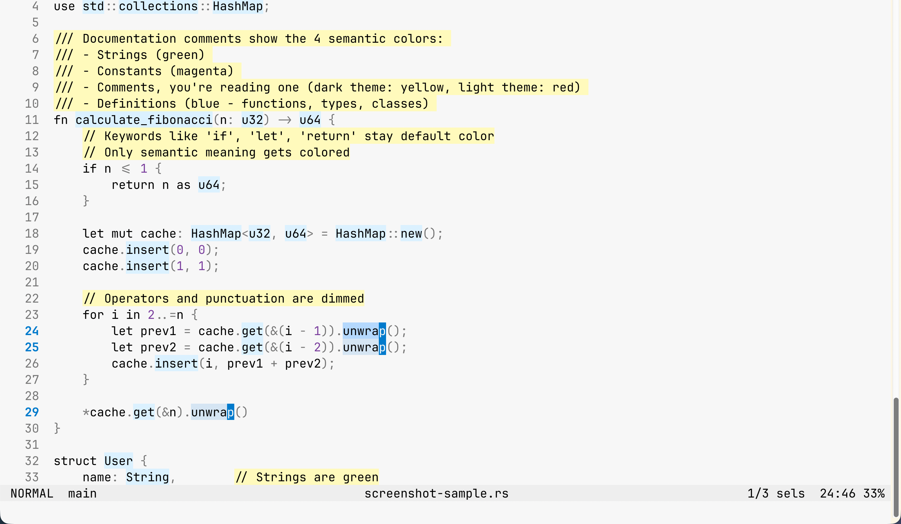
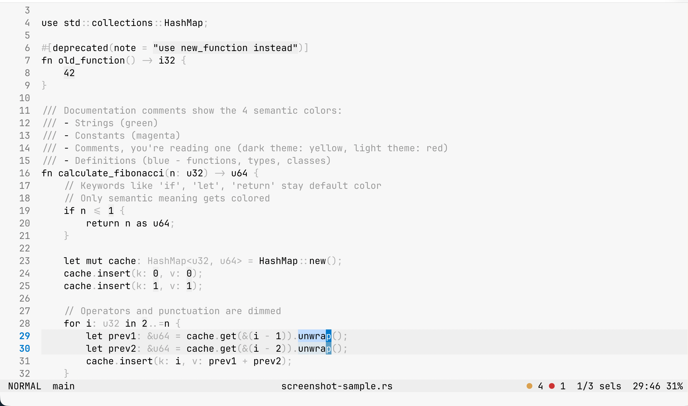
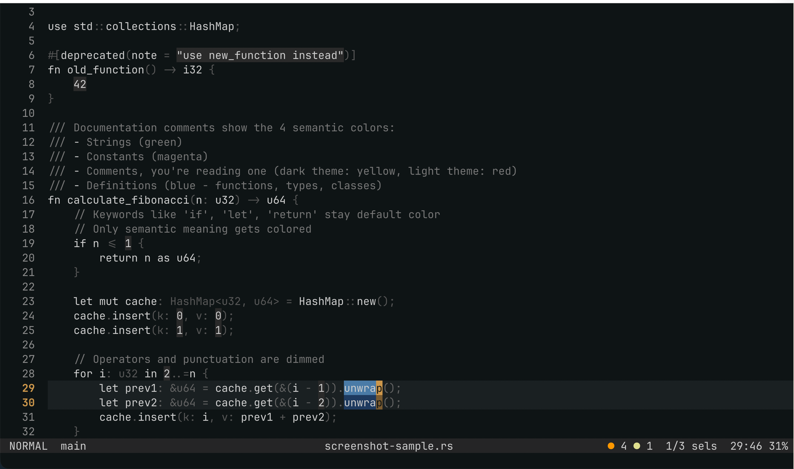

# Alabaster for Helix

Minimal Alabaster color themes for the [Helix editor](https://helix-editor.com/).

## Philosophy

These themes follow the [Alabaster philosophy](https://github.com/tonsky/sublime-scheme-alabaster) by Nikita Prokopov: minimal syntax highlighting that emphasizes readability over decoration.

**Only 4 semantic categories get color:**
- Strings (green)
- Constants (magenta)
- Comments (red - they're important!)
- Definitions (blue - functions, types, classes)

Everything else (keywords, variables, operators) uses the default foreground color because the structure of code is already clear from its formatting.

## Themes

This port includes the complete Alabaster family matching tonsky's original suite:

### Standard Variants (Text Color Highlighting)

**wolf-alabaster-light** - Light background with colored text


**wolf-alabaster-dark** - Dark background with colored text


### BG Variants (Background Color Highlighting)

**wolf-alabaster-light-bg** - Light background with colored backgrounds


**wolf-alabaster-dark-bg** - Dark background with colored backgrounds


### Mono Variants (Minimal Color)

**wolf-alabaster-light-mono** - Light background, mostly grayscale


**wolf-alabaster-dark-mono** - Dark background, mostly grayscale


## Installation

### Using dotx (recommended)

If you use [dotx](https://pypi.org/project/dotx/) to manage your dotfiles:

```bash
cd ~/<where-you-keep-your-dotfile-collections>/alabaster-for-helix
dotx install helix
```

This creates symlinks in `~/.config/helix/themes/` pointing to the theme files in this repo.

### Manual installation

Copy the theme files to your Helix themes directory:

```bash
cp helix/dot-config/helix/themes/*.toml ~/.config/helix/themes/
```

## Usage

Edit your `~/.config/helix/config.toml`:

```toml
# Standard variants (text color)
theme = "wolf-alabaster-light"
theme = "wolf-alabaster-dark"

# BG variants (background color)
theme = "wolf-alabaster-light-bg"
theme = "wolf-alabaster-dark-bg"

# Mono variants (minimal color)
theme = "wolf-alabaster-light-mono"
theme = "wolf-alabaster-dark-mono"
```

## Credits

- Based on [Alabaster](https://github.com/tonsky/sublime-scheme-alabaster) by Nikita Prokopov
- Adapted for Helix by Wolf

## License

MIT
